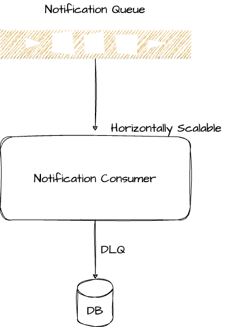

## Description

Notification consumer service. This service will consume the message from Kafka and hit the notification webhook_url.

## Dev Notes

- This architecture is a just a demonstration to show event-driven way of processing and sending notifications
- Kafka Setup and configuration might change for production env

## Architecture Diagram



## Prerequisite

- Docker

## Tech Stack

- Node.js
- Typescript
- Nestjs
- MongoDB
- TypeOrm
- Docker

## Installation

1. Clone the repo

```bash
$ git clone https://github.com/harsh-sri/notification-consumer
```

2. Switch to project directory

```bash
$ cd notification-consumer
```

### Notification Webhook Simulation

- [Follow the instructions mentioned here](https://learning.postman.com/docs/designing-and-developing-your-api/mocking-data/setting-up-mock/#creating-mock-servers)

## Environment Setup

- Create a `.env` file in the project root folder
- Copy the env keys from `env.sample` and provide the correct values

## Running the app

1. Start the application using Docker. App will run on PORT 3001

```bash
$ docker-compose up --build
```

## Test

```bash
# unit tests
$ npm run test
```

## Potential Improvements

- Instead of a single broker, we can have clusters
- DLQ processing is missing
